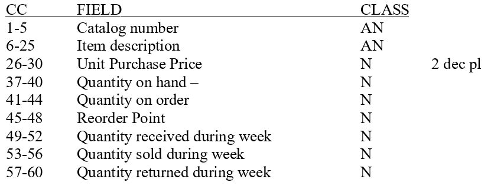

COBOL Initial Project 
======================

This project focuses on building an Inventory report based on the given Inventory Logs like PR1F17.txt. The output data for this project is saved in report.txt. 

# File Structure

# Usage
This project is useful for the creation of Inventory Reports to help with making future plans for a company or individual.

# COBOL
* This project was written using OpenCOBOL and was designed to run on none mainframe computers.
* This code is compatible with COBOL version 89 and above
* ANSI COBOL STANDARDS USED: X3.23a-1989

# Author
* [tylerbro93](https://github.com/tylerbro93/)

# License
This project is created under the [MIT License](./LICENSE)

# NOTES
* This project can be modified and used for free
* Give credit if used

# Project Flow Layout

